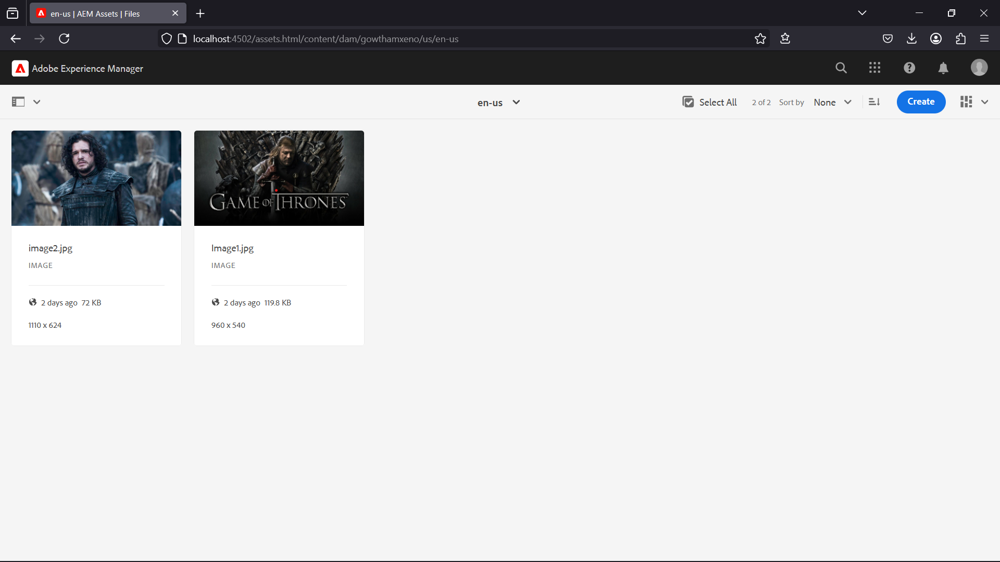
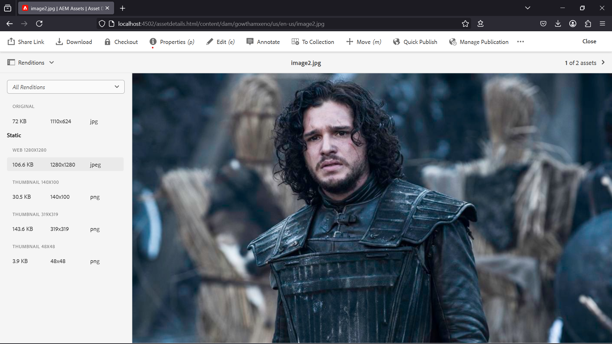
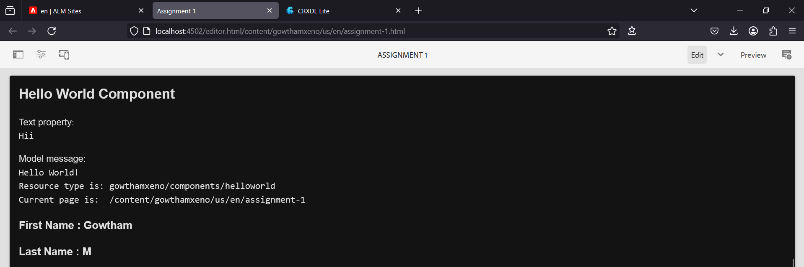
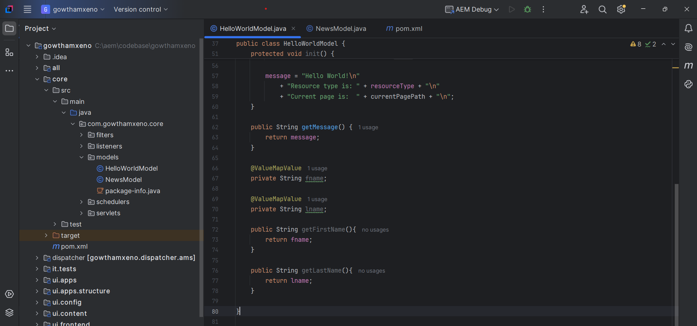
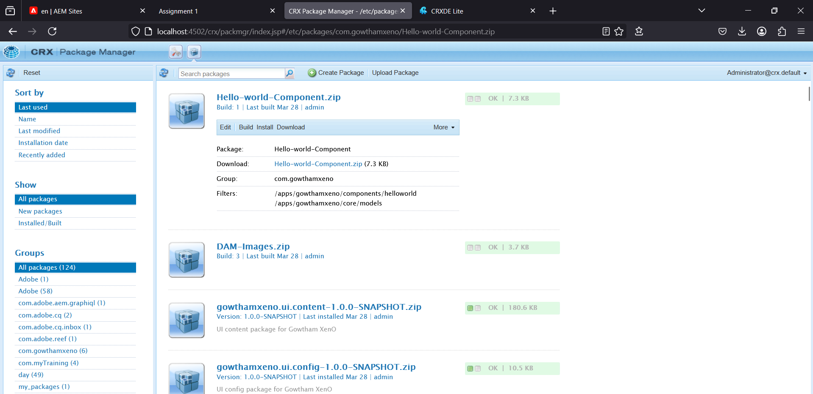
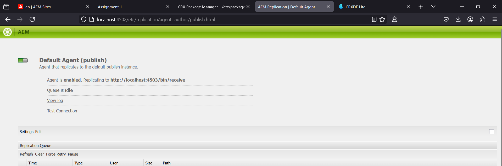

# AEM ASSIGNMENT (19-03-2025)

## *By Gowtham*

---

### 1. What is DAM and Why Do We Use It?

#### Answer:
**DAM (Digital Asset Management)** is a system in AEM that helps in storing, managing, and retrieving digital assets like images, videos, and documents efficiently.

#### Why do we use DAM?
- Centralized storage for digital assets.
- Supports metadata management.
- Generates renditions for different formats.
- Enables workflow and versioning.

---

### 2. Create One Folder Inside Our Project Folder and Follow the Path: 
```
/content/dam/gowthamxeno/us/en-us
```
#### Steps:
1. Navigate to DAM console: `http://localhost:4502/assets.html/content/dam`.
2. Create a folder inside `/content/dam/`.
3. Upload two images into `us/en-us`.
4. Author images using the **Image Component** on a page.

#### Screenshot:


---

### 3. What is Renditions?

#### Answer:
Renditions are automatically generated versions of an uploaded asset in different sizes and formats for better optimization and performance.

#### Steps to Check Renditions:
1. Open **AEM DAM Console**.
2. Select the uploaded image.
3. Go to **Properties → Renditions Tab**.
4. View the generated renditions like thumbnails, web-optimized images, etc.

#### Screenshot:


---

### 4. Add Two Fields in HelloWorld Component

#### Steps:
1. Open **CRXDE Lite**: `http://localhost:4502/crx/de/`
2. Navigate to `apps/myTraining/components/helloworld`.
3. Add `firstName` and `lastName` fields in `cq:dialog`.
4. Print values in `helloWorld.html` using properties.

#### Code Snippet:
```html
<p>First Name: ${properties.firstName}</p>
<p>Last Name: ${properties.lastName}</p>
```

#### Screenshot:


---

### 5. Try Using `@ValueMapValue` Annotation

#### Steps:
1. Open `HelloWorldModel.java`.
2. Add `@ValueMapValue` annotation for `firstName` and `lastName`.

#### Code Snippet:
```java
@Model(adaptables = Resource.class)
public class HelloWorldModel {
    @ValueMapValue
    private String firstName;

    @ValueMapValue
    private String lastName;

    public String getFirstName() {
        return firstName;
    }

    public String getLastName() {
        return lastName;
    }
}
```

#### Screenshot:


---

### 6. Why Are We Using Package Manager and JAR?

#### Answer:
The **Package Manager** in AEM is used to create, install, and transfer content packages between different environments (e.g., author to publish instances).

#### Steps to Create Packages:
1. Open **Package Manager**: `http://localhost:4502/crx/packmgr/index.jsp`
2. Create two packages:
   - **DAM Package** (Images from `/content/dam/myTraining/us/en-us`).
   - **HelloWorld Component Package** (Component from `/apps/gowthamxeno/components/helloworld`).
3. Build and download the packages.

#### Screenshot:


---

### 7. Configure Replication Agent and Publish the Page

#### Steps:
1. Open **Replication Agents** in AEM: `http://localhost:4502/etc/replication/agents.author.html`
2. Select **Default Agent** and configure with **publish environment URL (4503)**.
3. Click **Test Connection** to ensure connectivity.
4. Publish the page from **4502 → 4503**.
5. Open the published page: `http://localhost:4503/content/gowthamxeno/us/en.html`

#### Screenshot:


---
