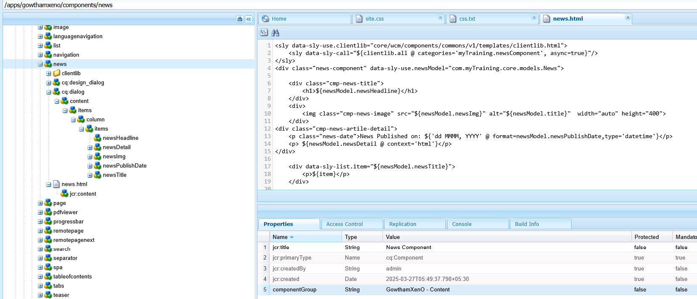
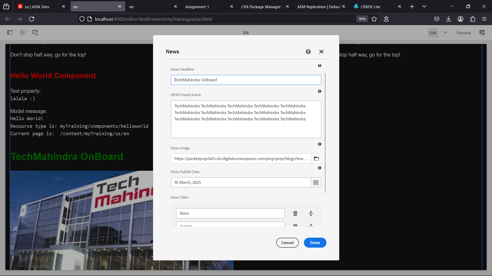
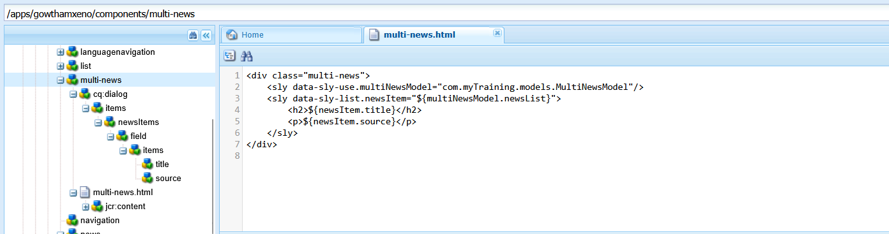
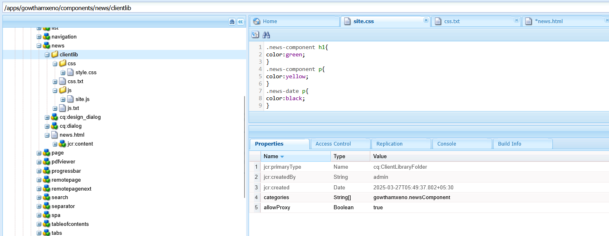
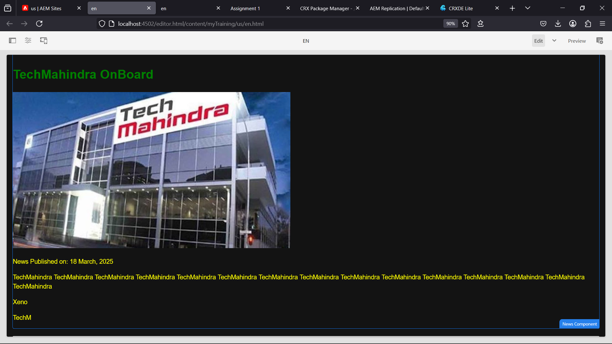
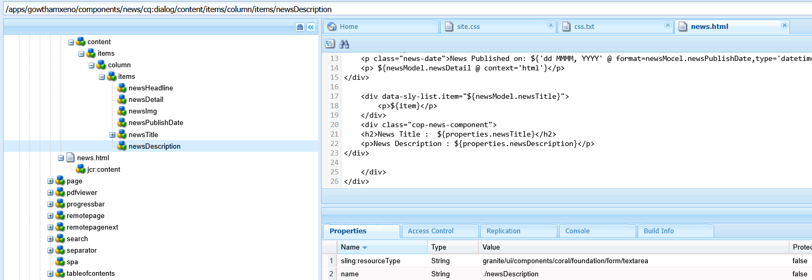
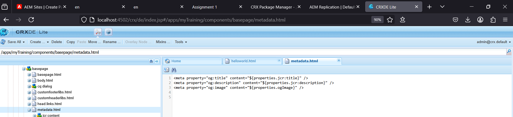
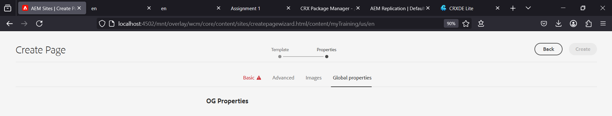
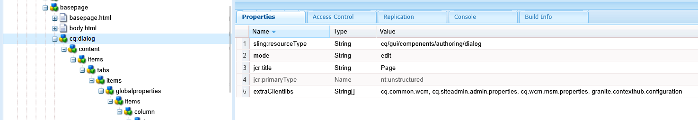

# AEM Training - Day 3 Assignment (20-03-2025) 

## Output Screenshots : [Click here](#screenshots)

---

## Day 2 (20-03-2025)

### 1. Create a New Component with News Title, News Detail, Published Date, and Source Using Sling Model
#### Answer:
We will create a new **News Component** using the **Sling Model** to display a **news title (h2)**, **news detail (p)**, **published date**, and **source**.

#### Steps:
1. Create a new component at `apps/gowthamxeno/components/news`.
2. Implement a Sling Model for this component.
3. Map component fields (`title`, `detail`, `date`, `source`).
4. Update `news.html` to display these fields.

#### Code Snippet (`NewsModel.java`):
```java
@Model(adaptables = Resource.class)
public class NewsModel {
    @Inject
    private String title;
    
    @Inject
    private String detail;
    
    @Inject
    private String date;
    
    @Inject
    private String source;

    public String getTitle() { return title; }
    public String getDetail() { return detail; }
    public String getDate() { return date; }
    public String getSource() { return source; }
}
```

#### Code Snippet (`news.html`):
```html
<div class="news-item">
    <h2>${newsModel.title}</h2>
    <p>${newsModel.detail}</p>
    <span>${newsModel.date}</span>
    <small>${newsModel.source}</small>
</div>
```
## Screenshots
1. **News Component**  
   
2. **Cq:Dialog**  
   
   <hr>
---

### 2. Create a Multi-field Component (Multiple News) Using Sling Model
#### Answer:
A multi-field component allows authors to add **multiple news items** dynamically.

#### Steps:
1. Create a multi-field component at `apps/gowthamxeno/components/multi-news`.
2. Implement a **Sling Model List**.
3. Map fields: **title** and **source**.
4. Update `multi-news.html` to loop through news items.

#### Code Snippet (`MultiNewsModel.java`):
```java
@Model(adaptables = Resource.class)
public class MultiNewsModel {
    @Inject
    @Children
    private List<NewsModel> newsList;
    
    public List<NewsModel> getNewsList() { return newsList; }
}
```

#### Code Snippet (`multi-news.html`):
```html
<div class="multi-news">
    <sly data-sly-list.newsItem="${multiNewsModel.newsList}">
        <h2>${newsItem.title}</h2>
        <p>${newsItem.source}</p>
    </sly>
</div>
```
## Screenshots
1. **Multi-news**  
   
---

### 3. Create Clientlibs for News Component
#### Answer:
Clientlibs are used to **apply styles and scripts** to components.

#### Steps:
1. Create a clientlib at `apps/gowthamxeno/clientlibs/news`.
2. Include **CSS and JS** files.
3. Add clientlib categories in the component.

#### Code Snippet (`clientlibs/news/css.txt`):
```txt
news.css
```

#### Code Snippet (`style.css`):
```css
.news-component h1{
color:green;
}
.news-component p{
color:yellow;
}
```
## Screenshots
1. **Clientlib**  
   
---

### 4. Apply Green Color to Heading (h2), Yellow to News Detail (p), and Black to Date
#### Answer:
This is done using **CSS** inside the `clientlibs/news`.

#### Code Snippet:
```css
.news-component h1{
color:green;
}
.news-component p{
color:yellow;
}
```
## Screenshots
1. **News Component**  
   
---

### 5. Add Component Style (cop-news-component) in News Component
#### Answer:
We will add a **custom style name** to the news component.

#### Steps:
1. Navigate to `apps/gowthamxeno/components/news` in **CRXDE Lite**.
2. Update `cq:dialog` to include the style property.
3. Modify `news.html` to include the class.

#### Code Snippet:
```html
<div class="cop-news-component">
    <h2>${properties.newsTitle}</h2>
    <p>${properties.newsDescription}</p>
</div>
```
## Screenshots
1. **Style**  
   
---

### 6. Create a Base Page Component and Add Metadata for OG Tags
#### Answer:
We will create a `metadata.html` file to **print OG meta tags**.

#### Steps:
1. Create `metadata.html` inside the `basepage` component.
2. Add OG metadata properties.
3. Link `metadata.html` in `basepage.html`.

#### Code Snippet (`metadata.html`):
```html
<meta property="og:title" content="${pageProperties.ogTitle}">
<meta property="og:description" content="${pageProperties.ogDescription}">
<meta property="og:image" content="${pageProperties.ogImage}">
```
## Screenshots
1. **Base Page Properties**  
   
---

### 7. Create Custom Page Properties (Global Properties)
#### Answer:
Adding three custom fields (`og:title`, `og:description`, `og:image path`) in **Page Properties**.

#### Steps:
1. Navigate to `apps/gowthamxeno/components/page/basepage/cq:dialog`.
2. Add a **tab** named `Global Properties`.
3. Create fields: `ogTitle`, `ogDescription`, `ogImage`.
## Screenshots
1. **Global Properties**  
   
---

### 8. What is ExtraClientLibs and How to Use It in a Multi-field Component?
#### Answer:
**extraClientLibs** is used to include **CSS & JavaScript**.

#### Code Snippet:
```xml
<extraClientLibs jcr:primaryType="nt:unstructured">
    <css>
        <item0>clientlibs/gowthamxeno/styles.css</item0>
    </css>
</extraClientLibs>
```
## Screenshots
1. **extraClientLibs**  
   
---
