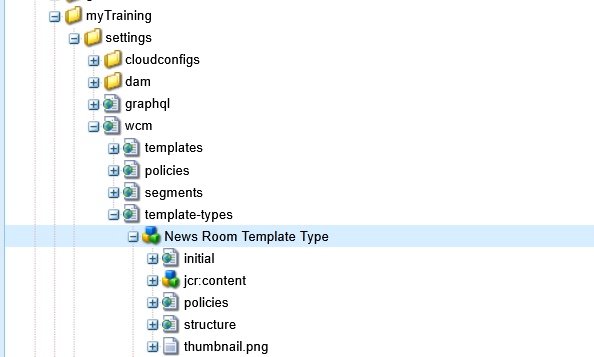
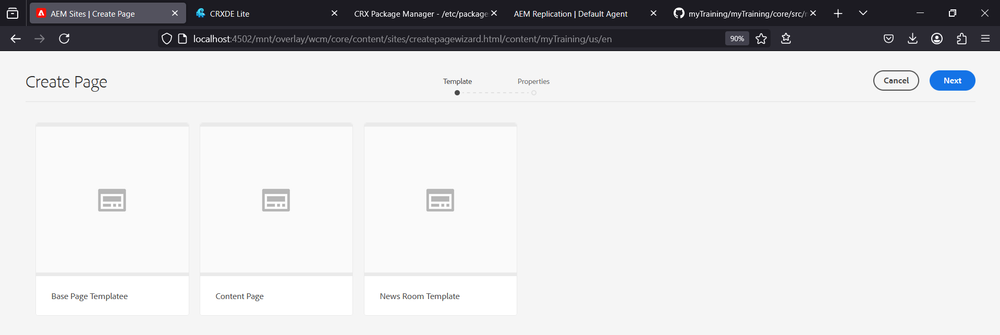

# AEM Training - Day 4 Assignment (21-03-2025)

## Table of Contents
- [Create News Room Page Component](#create-news-room-page-component)
- [Create Custom Page Property - NEWS Configurations](#create-custom-page-property---news-configurations)
- [Create News Room Template Type](#create-news-room-template-type)
- [Create News Room Template](#create-news-room-template)
- [Apply Styling to News/HelloWorld Component](#apply-styling-to-newshelloworld-component)
- [Create Custom Style for Components](#create-custom-style-for-components)

---

## Create News Room Page Component  

### 📌 Steps:
1. **Open CRXDE:**  
    Navigate to `http://localhost:4502/crx/de/`.
2. Navigate to the following path:
    ```
    /apps/myTraining/components
    ```
3. Create a new folder named `newsroom`.
4. Inside the `newsroom` folder, create the following files:
    - `newsroom.html`
    - `_cq_dialog.xml` (for dialog fields).
5. Add the following content to the `newsroom.html` file:
    ```html
    <div data-sly-use.basePage="com.myTraining.core.models.BasePage">
         <h1>${basePage.pageTitle}</h1>
    </div>
    ```
6. Save and build the project.

---

## Create Custom Page Property - NEWS Configurations  

### 📌 Steps:
1. **Open CRXDE:**  
    Navigate to `http://localhost:4502/crx/de/`.
2. Navigate to the following path:
    ```
    /apps/myTraining/components/newsroom
    ```
3. Add a **Page Properties Dialog**:
    - Create a file named `_cq_dialog.xml`.
    - Add the following fields:
      - `og:title`
      - `og:description`
      - `og:image path`
4. Save and deploy the changes.


---

## Create News Room Template Type  

### 📌 Steps:
1. Navigate to the following path:
    ```
    /conf/myTraining/settings/wcm/template-types
    ```
2. Create a new template type with the following details:
    - **Name:** News Room Template Type
    - **Allowed Paths:** `/content/myTraining/*`
3. Save and activate the template type.


---

## Create News Room Template  

### 📌 Steps:
1. Navigate to the following path:
    ```
    /conf/myTraining/settings/wcm/templates
    ```
2. Click **Create Template** and select **News Room Template Type**.
3. Name the template **News Room Template**.
4. Save and enable the template.

---

## Apply Styling to News/HelloWorld Component  

### 📌 Steps:
1. Navigate to the following path:
    ```
    /apps/myTraining/ui.frontend
    ```
2. Open the CSS file located at:
    ```
    /apps/myTraining/ui.frontend/src/styles/news.css
    ```
3. Add the following styles:
    ```css
    .newsroom-title {
         color: green;
         font-size: 24px;
    }
    
    .newsroom-description {
         color: yellow;
    }
    
    .newsroom-date {
         color: black;
    }
    ```
4. Save and deploy the changes.

---

## Create Custom Style for Components  

### 📌 Steps:
1. **Open CRXDE:**  
    Navigate to `http://localhost:4502/crx/de/`.
2. Navigate to the following path:
    ```
    /apps/myTraining/components/newsroom
    ```
3. Create a **Style System**:
    - **Path:** `/apps/myTraining/components/newsroom/_cq_design_dialog.xml`
    - Add the following custom style configuration:  
      ```xml
      <cq:dialog>
            <items jcr:primaryType="cq:WidgetCollection">
                 <styleGroup jcr:primaryType="nt:unstructured"
                                 sling:resourceType="cq/gui/components/authoring/dialog/style">
                      <styles jcr:primaryType="nt:unstructured">
                            <style1 jcr:primaryType="nt:unstructured"
                                      text="Newsroom Custom Style"
                                      class="newsroom-custom-style"/>
                      </styles>
                 </styleGroup>
            </items>
      </cq:dialog>
      ```
4. Save and deploy the changes.
---

## Screenshots
1. **Template Type**  
   

4. **Template**  
   
