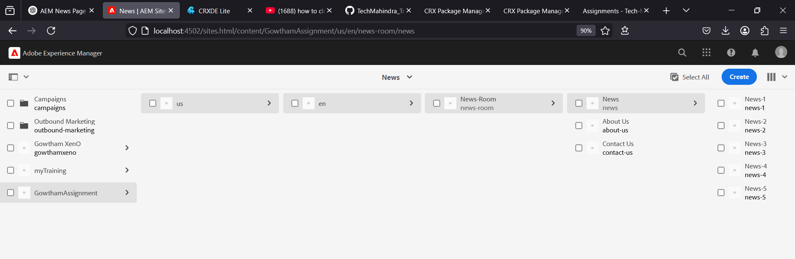
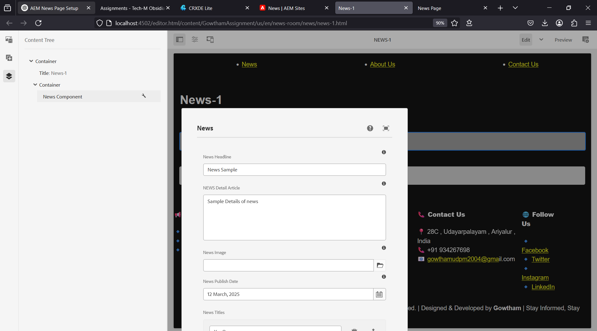
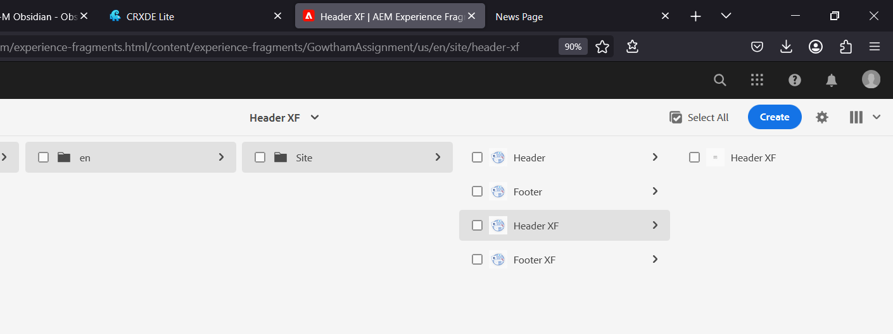
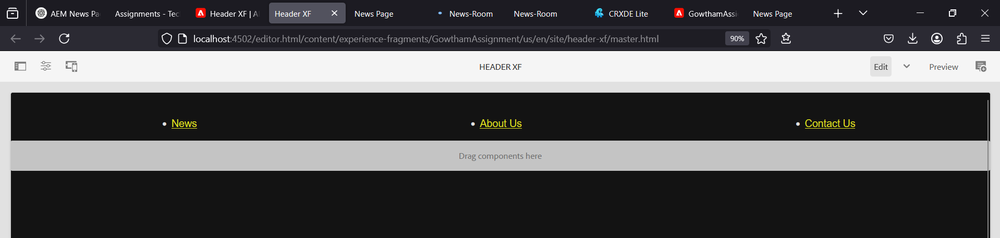
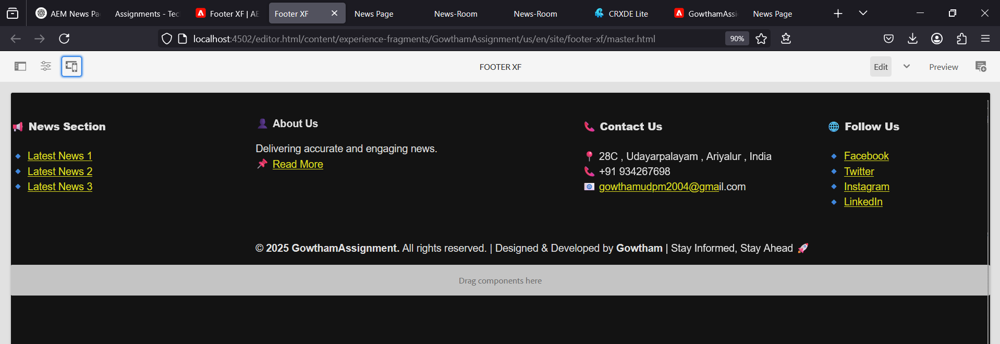
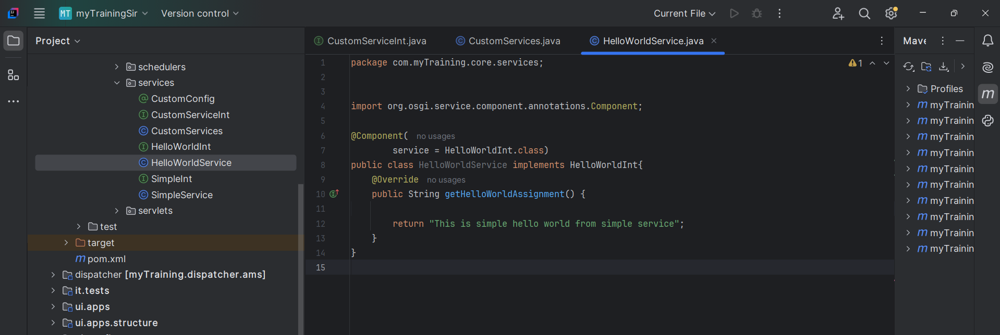

# AEM Training - Day 5 Assignment (24-03-2025)

## Output Screenshots : [Click here](#screenshots)

---

## Implementation Guide

### 1. Creating News Articles
#### Description:
We will create structured **News Articles** in AEM under a dedicated section.

#### Steps:
1. Navigate to **/content/us/en/news** in AEM.
2. Create five unique **news pages** with:
   - **Headline** (`h2`)
   - **Article Content** (`p`)
   - **Publication Date**
## Screenshots
1. **News Pages**
   
---

### 2. Adding the News Component
#### Description:
The **News Component** will display news articles dynamically.

#### Steps:
1. Use the **existing News Component** to render articles.
2. Ensure it includes:
   - **Headline** (`<h2>`) with distinct styling.
   - **News Content** (`<p>`) for article details.
   - **Publication Date** with proper formatting.
3. Maintain a **responsive and visually appealing design**.

#### Code Snippet (`NewsComponent.html`):
```html
<div class="news-item">
    <h2>${newsModel.headline}</h2>
    <p>${newsModel.content}</p>
    <span>${newsModel.publicationDate}</span>
</div>
```
## Screenshots
1. **News Component**
   
---

### 3. Setting Up the Header
#### Description:
A **Header Experience Fragment** will be created for seamless navigation.

#### Steps:
1. Create a **Header Fragment**.
2. Include navigation links to:
   - **News Section** (linking to news pages)
   - **About Me** page
   - **Contact Us** page

## Screenshots
1. **Experience Fragments**
   
---
2. **Header XF**
   
---

### 4. Configuring the Footer
#### Description:
A **Footer Experience Fragment** will be configured with multiple sections.

#### Sections:
1. **Latest News Section**:
   - Use a **List Component** to display recent news articles.
2. **About Me Section**:
   - Add a **Text Component** with journalist details.
3. **Contact Section**:
   - Include office address, phone number, or email.
4. **Social Media Section**:
   - Use a **List Component** for social media links.

## Screenshots
1. **Footer XF**
   
---

### 5. Developing a Custom Service
#### Description:
A **Custom OSGi Service** will be developed to return a simple response.

#### Steps:
1. Create an OSGi service class in **Java**.
2. Inject it into the **News Component’s Sling Model**.
3. Log the service output in AEM logs.

#### Code Snippet (`HelloWorldService.java`):
```java
@Designate(ocd = HelloWorldConfig.class)
@Component(service = HelloWorldInt.class)
public class HelloWorldService {
    public String getMessage() {
        return "Hello World from Custom Service";
    }
}
```
## Screenshots
 **Service**
   
---

### 6. Implementing API Configuration
#### Description:
We will develop a configuration to **store third-party API URLs** and fetch data.

#### Steps:
1. Define an OSGi configuration for API URLs.
2. Fetch JSON data from a sample API.
3. Log the response in AEM logs.

#### Example API:
```txt
https://jsonplaceholder.typicode.com/posts
```

---

