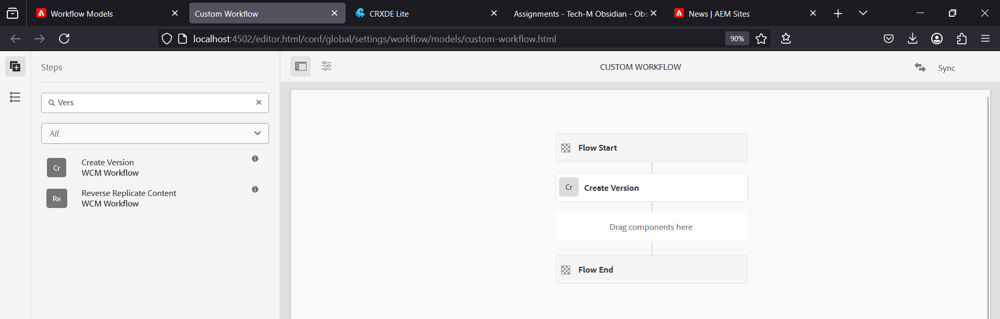
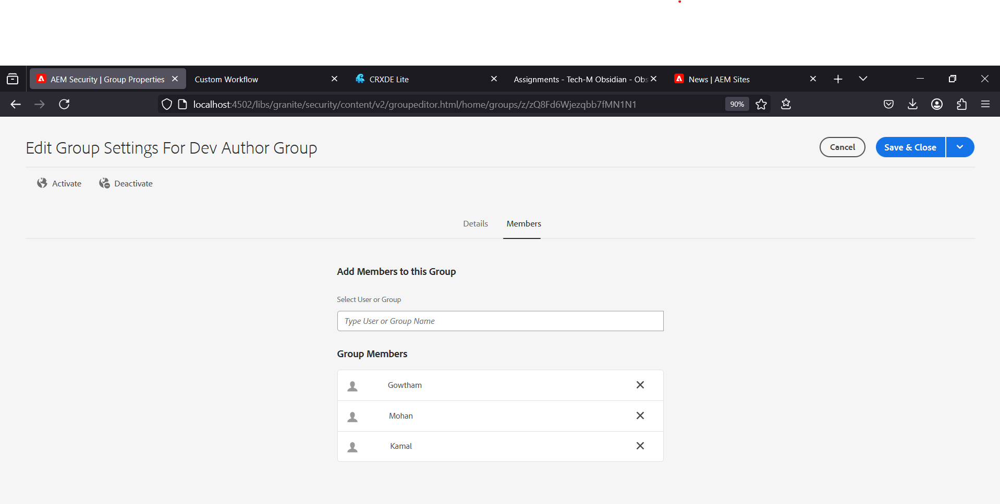

# AEM Training - Day 6 Assignment (25-03-2025) 

---

## Implementation Guide

### 1. Create a Custom Workflow (my custom workflow)

#### Description:

A custom workflow will be created in AEM to handle specific tasks.

#### Steps:

1. Navigate to **Tools > Workflow > Models** in AEM.
2. Create a new workflow model named **my custom workflow**.
3. Add workflow steps to process content.
4. Save and activate the workflow.

---

### 2. Create a Custom Workflow Process to Print Page Title in Logs

#### Description:

AEM Workflow Process step will be created to log page titles and metadata.

#### Steps:

1. Develop a custom **Workflow Process** class.
2. Extract the **page title** from the resource.
3. Log the title and metadata in AEM logs.
4. Assign the workflow to a page and run it.

#### Code Snippet (`CustomWorkflowProcess.java`):

```java
@Component(service = WorkflowProcess.class, immediate = true)
public class CustomWorkflowProcess implements WorkflowProcess {
    private static final Logger LOG = LoggerFactory.getLogger(CustomWorkflowProcess.class);

    @Override
    public void execute(WorkItem workItem, WorkflowSession workflowSession, MetaDataMap metaDataMap) throws WorkflowException {
        String pageTitle = workItem.getWorkflowData().getPayload().toString();
        LOG.info("Processing page: " + pageTitle);
    }
}
```

---

### 3. Create an Event Handler in AEM to Print Resource Path in Logs

#### Description:

An AEM **Event Listener** will log resource changes.

#### Steps:

1. Create an **OSGi Event Listener**.
2. Listen for **resource added/modified/deleted** events.
3. Log the resource path in AEM logs.

#### Code Snippet (`EventHandler.java`):

```java
@Component(service = EventHandler.class)
public class CustomEventHandler implements EventHandler {
    private static final Logger LOG = LoggerFactory.getLogger(CustomEventHandler.class);

    @Override
    public void handleEvent(Event event) {
        LOG.info("Resource changed: " + event.getProperty("path"));
    }
}
```

---

### 4. Create a Sling Job to Print "Hello World" in Logs

#### Description:

A **Sling Job** will be scheduled to log a simple message.

#### Steps:

1. Develop a Sling Job class.
2. Log a **Hello World** message.
3. Trigger the job manually or programmatically.

#### Code Snippet (`SlingJob.java`):

```java
@Component(service = JobConsumer.class, immediate = true, property = {JobConsumer.PROPERTY_TOPICS + "=com/gautam/hello"})
public class HelloWorldJob implements JobConsumer {
    private static final Logger LOG = LoggerFactory.getLogger(HelloWorldJob.class);

    @Override
    public JobResult process(Job job) {
        LOG.info("Hello World from Sling Job");
        return JobResult.OK;
    }
}
```

---

### 5. Create a Scheduler to Print "Hellow World" in Logs Every 5 Minutes

#### Description:

An AEM **Scheduler** will print a message at a fixed interval using a **cron expression**.

#### Steps:

1. Create a **Scheduler** using OSGi configuration.
2. Set a cron job to run every **5 minutes**.
3. Log the **Hellow World** message.

#### Code Snippet (`Scheduler.java`):

```java
@Component(service = Runnable.class, immediate = true, property = { "scheduler.expression=0 */5 * * * ?" })
public class HellowWorldScheduler implements Runnable {
    private static final Logger LOG = LoggerFactory.getLogger(HellowWorldScheduler.class);

    @Override
    public void run() {
        LOG.info("Hellow World");
    }
}
```

---

### 6. Create 3 Users and Add Them to a Group with Read and Replication Access

#### Description:

Three users will be created and added to a new group with limited permissions.

#### Steps:

1. Navigate to **Tools > Security > Users**.
2. Create three users: `user1`, `user2`, `user3`.
3. Navigate to **Groups** and create a new group **Dev Author**.
4. Add all three users to **Dev Author**.
5. Assign **read-only** access to **/content** and **/dam**.
6. Grant **replication access** to the group.

---

## Screenshots

1. **Custom Workflow**  
   
2. **User Group**  
   
